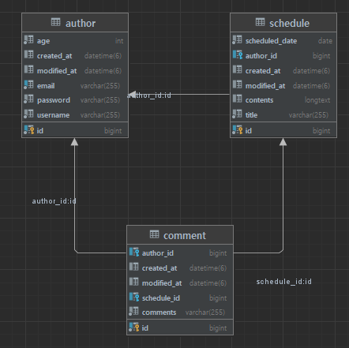

# Schedule

This project is to study how to use Spring Boot based on JPA. Many people can save their info and schedule with their email and password. You can also saves comment of each schedule.
Login is required to access on this service. Passwords are encoded with session.

## ERD

## REST API Specification

### Authors API

| Method | Endpoint        | Request Body                                                                                         | Response Body                                                    | Status        |
|--------|-----------------|------------------------------------------------------------------------------------------------------|------------------------------------------------------------------|---------------|
| POST   | /authors/signup | {"username":name of the user, "email":email, "password":password,"age":age}                          | {"id":id, "username":name of the user, "email":email, "age":age} | 200, 409      |
| GET    | /authors/{id}   | None                                                                                                 | {"username":name of the user, "age":age, "email":email}          | 200, 204      |
| PATCH  | /authors/{id}   | {"oldPassword":password before,"newPassword":password after, "username":name of the user, "age":age} | None                                                             | 200, 401, 409 |

### Schedules API

| Method | Endpoint        | Request Body                                                         | Response Body                                                                       | Status        |
|--------|-----------------|----------------------------------------------------------------------|-------------------------------------------------------------------------------------|---------------|
| POST   | /schedules      | {"title":title, "contents":contents, "scheduledDate":Scheduled Date} | {"id":id, "title":title, "contents":contents, "scheduledDate":Scheduled Date}       | 200           |
| GET    | /schedules      | None                                                                 | Page<{"id":id, "title":title, "contents":contents, "scheduledDate":Scheduled Date}> | 200           |
| GET    | /schedules/{id} | None                                                                 | {"id":id, "title":title, "contents":contents, "scheduledDate":Scheduled Date}       | 200, 204      |
| PATCH  | /schedules/{id} | {"title":title, "contents":contents, "scheduledDate":Scheduled Date} | None                                                                                | 200, 204, 403 |
| DELETE | /schedules/{id} | None                                                                 | None                                                                                | 200, 204, 403 |

### Login API

| Method | Endpoint  | Request Body       | Response Body   | Status |
|--------|----------|--------------------|----------------|--------|
| GET    | /home    | None               | HTML Page      | 200    |
| POST   | /login   | LoginRequestDto    | Redirect       | 200    |
| POST   | /logout  | None               | Redirect       | 200    |

### Comments API

| Method | Endpoint                              | Request Body          | Response Body                                                                                       | Status        |
|--------|---------------------------------------|-----------------------|-----------------------------------------------------------------------------------------------------|---------------|
| POST   | /schedules/{scheduleId}/comments      | {"comments":comments} | {"id":id of the comment, "comments":comment, "scheduledId":id of the schedule, "email":email}       | 200, 204      |
| GET    | /schedules/{scheduleId}/comments      | None                  | List<{"id":id of the comment, "comments":comment, "scheduledId":id of the schedule, "email":email}> | 200           |
| PATCH  | /schedules/{scheduleId}/comments/{id} | {"comments":comments} | None                                                                                                | 200, 204      |
| DELETE | /schedules/{scheduleId}/comments/{id} | None                  | None                                                                                                | 200, 204, 403 |

### Notes
- `{id}` and `{scheduleId}` are of type `long`.
- Response status `200` indicates success, while `302` is for redirections.
- DTOs should be properly validated using `@Valid` annotation in Spring Boot.